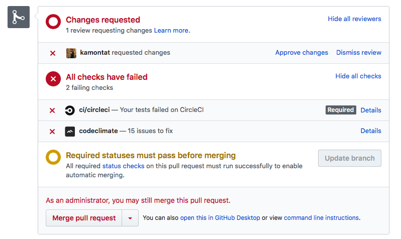
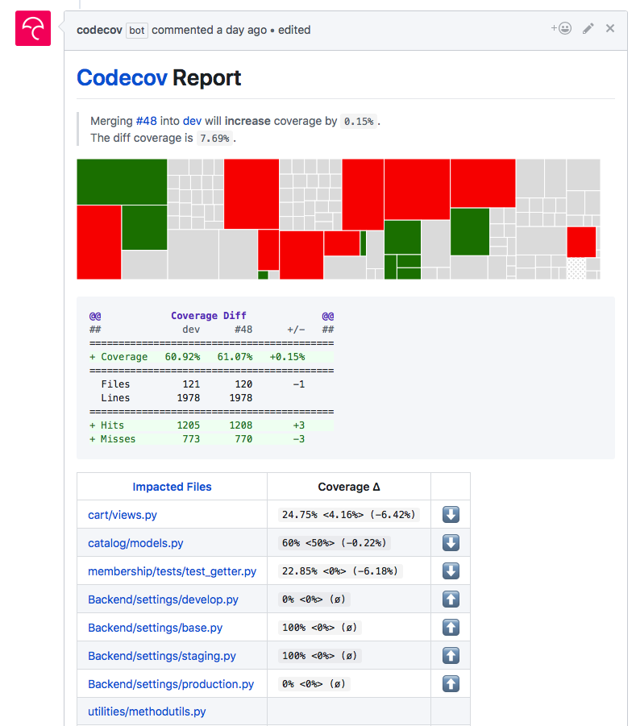

# Pairmhai Backend [](https://github.com/PairMhai/Backend/tags) [](https://github.com/PairMhai/Backend/releases/latest) [](https://github.com/PairMhai/Backend/blob/master/LICENSE)

## Badges 
|Type                 |Environment|badges|
|----------------------|-----------|------|
|Test                  |Develop    |[](https://circleci.com/gh/PairMhai/Backend/tree/dev)|
|                      |Production |[](https://circleci.com/gh/PairMhai/Backend/tree/master)|
|Dependency            |Develop    |[](https://requires.io/github/PairMhai/Backend/requirements/?branch=dev)|
|                      |Production |[](https://requires.io/github/PairMhai/Backend/requirements/?branch=master)|
|Coverage              |Develop    |[](https://codecov.io/gh/PairMhai/Backend/branch/dev)|
|Coverage              |Production |[](https://codecov.io/gh/PairMhai/Backend/branch/master)|
|Code-Climate:coverage |           |[](https://codeclimate.com/github/PairMhai/Backend/maintainability)|
|Code-Climate:coverage |           |[](https://codeclimate.com/github/PairMhai/Backend/test_coverage)|
|Code-Climate:issues   |           |[](https://codeclimate.com/github/PairMhai/Backend/issues)|

<!-- [](https://codeclimate.com/github/PairMhai/Backend/code) -->


# Table of Contents
- [Install guide](#install-guide)
- [Develop guide](#develop-guide)
    - [CI](#ci)
    - [Branch naming](#branch-naming)
            - [Example](#example)
    - [Pull Request](#pull-request)
            - [image](#image)
- [Deploy guide](#deploy-guide)
- [Documentation](#documentation)
- [Contribution](#contribution)

# Install guide
1. anaconda is required to set envrionment [link](https://www.anaconda.com/download/)
    - the command line interface (cli) is enough.

1. create require envrionment by `conda create --name pairmhai --file requirements_conda.txt` (first time **ONLY**)
2. activate environment by `source activate pairmhai`
3. (optional) validate by run `conda info --envs` the star (`*`) should be on pairmhai name like this...
```
# conda environments:
#
pairmhai              *  ~/anaconda3/envs/pairmhai
root                     ~/anaconda3
```
4. install more needed library by `pip install -r requirements.txt`
5. setup database:
    1. `./utils.sh m` - to migrate database
    2. `./utils.sh l` - to load fixture data
    3. `./utils.sh t` - to test
6. run server by `./utils.sh s` or `python manage.py runserver`
7. the server will run on **http://localhost:8000**

# Develop guide
## CI
This project have CI testing coverage and analyze code
- Circle-CI - Main testing
- codecov - coverage code and report while create pull request
- codeclimate - coverage and analyze code (include duplication style and more)

All run on both commit and [pull request](#pull-request) so you need to pass at least circle-ci testing and try to add more coverage code, It will be good to minimize codeclimate-issue

## Branch naming
- start with type - 
    - fix|fixes - for fix bug(s)
    - setup|initial - for setup or start do something
    - update - for update code or model
    - upgrade - for upgrade dependencies 
    - test|testing - for add new test
- next is short-explanation, all separate by /

#### Example 
- fix/issue/123
- setup/CI/testing
- update/cart
- inital/library/payment
- testing/cart/calculation

## Pull Request
Pass `Circle-CI` is a minimum requirement for accept pull request.  
The pull-request, there have workflow
1. create pull request to your base branch (you cannot create pull request to master - if it, your will be deny anyway)
2. fill PR `type/introduce`, `description` and check all requirements.
3. wait.
    1. Circle-CI will take about 1-2 minutes to run the test
    2. codeclimate will report issues to you, try to fix it all
    3. In a minutes codecov will comment the report of your pull-request and try to make more coverage
4. wait owner to review the code and try to fix the issue that reported on your PR
5. if done, your pull-request will merge to dev and wait for deploy in next version

#### image
1. example of testing in pull-request

2. example of codecov report



# Deploy guide
1. setup [buildpack](https://github.com/weibeld/heroku-buildpack-run): `heroku buildpacks:add https://github.com/weibeld/heroku-buildpack-run.git`
2. add heroku remote: `git remote add heroku https://git.heroku.com/pairmhai-api.git`
3. run push command: `git push heroku <local-branch>:master`

# Documentation
1. [Document link](doc/README.md)
2. [utils.sh](doc/utils.md)

# Contribution
- [Need to know](doc/contributions/README.md)
- [Contribution list](summary-code/information.txt)
